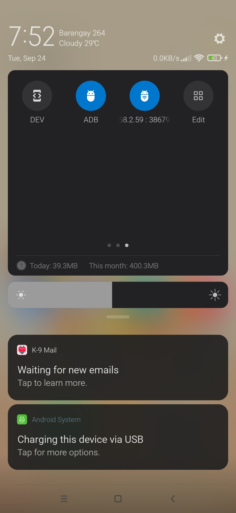
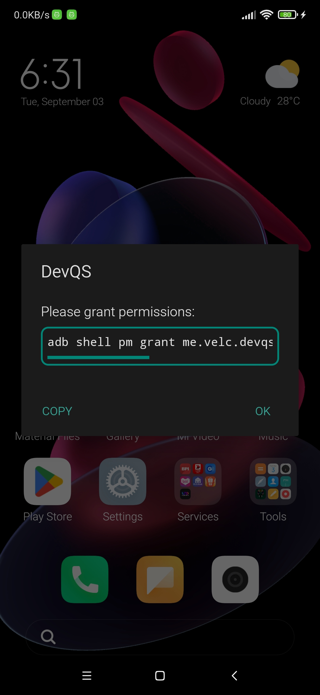

# DevQS

Quick Settings tiles for developers

Tired of banking and other financial apps whining that Developer Options is on? With *DevQS*,
Developer Options can be toggled off then back on from the Quick Settings panel without resetting
other settings. Long-clicking on any of the tiles will also open the Developer Options settings
screen if the DEV toggle is on.

**IMPORTANT:**

There is no launcher icon nor activity. The tiles must be manually added to the Quick Settings panel.
The app requires the permission WRITE_SECURE_SETTINGS which can be granted using ADB.

`adb shell pm grant me.velc.devqs android.permission.WRITE_SECURE_SETTINGS`

## Screenshots

 